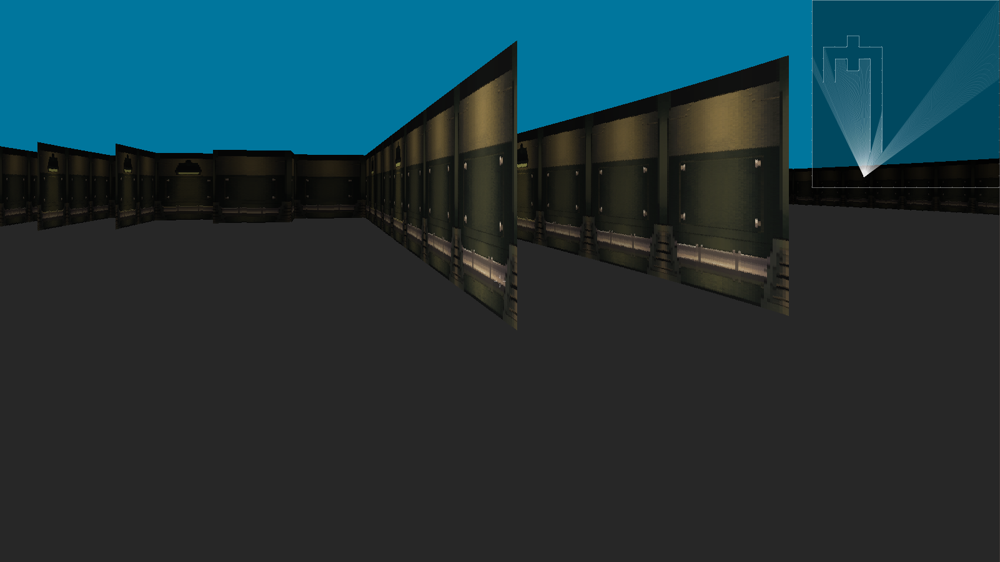

# Raycasting engine



## Overview
A pseudo 3D engine from scratch, based on raycasting written in C++, using SDL2 for visualization. The map can be edited by hardcoding a matrix representing the map. Several different wall components are available, indicating the wall orientation and texture. Combinations of wall orientation are possible. The player can walk and look around, as well as jump and collide with the walls. The minimap in the top right corner shows the 2D raycasting on which the 3D visualization is based on.

## Installation
Clone the repo:
```
git clone https://github.com/LennardMarx/raycast_engine.git
```
Build the game:
```
cd raycast_engine
chmod +x build.sh
./build.sh
```
Run the game:
```
./bin/raycasting
```

## Controls
WASD - walk\
QE - turn\
Space - jump\
